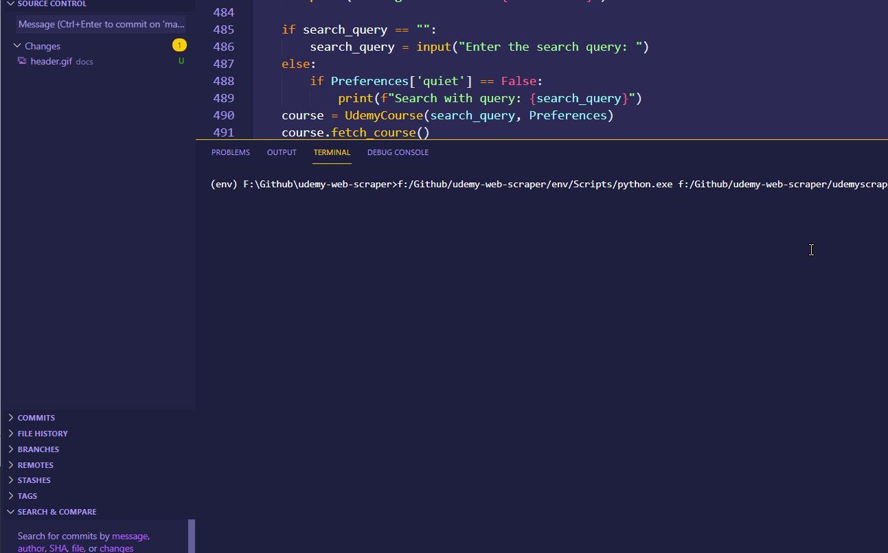
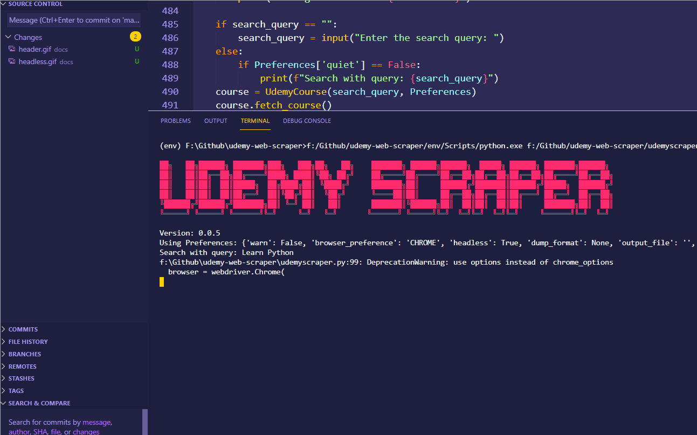

A Web Scraper built with beautiful soup, that fetches udemy course information.

## Table Of Contents

- [Usage](#usage)
  - [As a Module](#as-a-module)
  - [As a Script](#as-a-script)
    - [List of Commands](#list-of-commands)
- [Installation](#installation)
  - [Virtual Environment](#virtual-environment)
  - [Dependencies  Installation](#dependencies--installation)
- [Browser Setup](#browser-setup)
  - [Chrome (or chromium)](#chrome-or-chromium)
  - [Firefox](#firefox)
  - [Suppressing Browser](#suppressing-browser)
- [Approach](#approach)
  - [Why not just use the Udemy's API?](#why-not-just-use-the-udemys-api)
- [Data](#data)
  - [Course Class](#course-class)
  - [Section Class](#section-class)
  - [Lesson Class](#lesson-class)
- [Output/ Dumping data](#output-dumping-data)
  - [Quick Display](#quick-display)
  - [Converting to Dictionary](#converting-to-dictionary)
  - [Dumping as JSON](#dumping-as-json)
  - [Dumping as CSV](#dumping-as-csv)
  - [Dumping as XML](#dumping-as-xml)
    - [For Jellyfin users](#for-jellyfin-users)
- [Contributing](#contributing)

# Usage
This section shows the basic usage of this script. Before this be sure to [install](#installation) this first before importing it in your file.

## As a Module

Udemyscraper contains a `UdemyCourse` class which can be imported into your file it takes just one argument which is `query` which is the seach query. It has a method called `fetch_course` which you can call after creating a UdemyCourse object.

```py
from udemyscraper import UdemyCourse

course = UdemyCourse('learn javascript')
course.fetch_course()
```

## As a Script

In case you do not wish to use the module in your own python file but you just need to dump the data, `udemyscraper.py` file can be directly invoked and can also be executed along with a variety of arguments and options.

You can do so by running the udemyscraper.py file along with passing the required arguments.

``` bash
python3 udemyscraper.py <command>    
```
Here is an example of dumping the data as a json file.

```bash
python3 udemyscraper.py -d json -q "German course for beginners"
```

### List of Commands


# Installation
## Virtual Environment
Before installing the dependencies it is recommended to setup a virtual environment. 

<details>

You can setup a virtual environment on your machine by using the `virtualenv` library and then activating it.

```bash
pip install virtualenv

virtualenv somerandomname

```

Activating for \*nix

```bash
source somerandomname/bin/activate
```

Activating for Windows

```
somerandomname\Scripts\activate
```
</details>


## Dependencies  Installation
You are required to install all of the modules listed in `requirements.txt` file.

```bash
pip install -r requirements.txt
```

# Browser Setup

A browser window may not pop-up as I have enabled the  `headless` option so the entire process takes minimal resources.

This script works with firefox as well as chrome.

## Chrome (or chromium)

To run this script you need to have chrom(ium) installed on the machine as well as the chromedriver binary which can be downloaded from this [page](https://chromedriver.chromium.org/downloads). Make sure that the binary you have installed works on your platform/ architecture and the the driver version corresponds to the version of the browser you have downloaded.

I have already provided a windows binary of the driver in the repo itself which supports chrom(ium) 92. You can use that or you can get your specific driver from the link above.

To set chrome as default you can pass in an argument while initializing the class though it is set to chrome by default.

```py
mycourse = UdemyCourse(browser_preference="CHROME")
```
Or you can pass in a argument while using as a script
```bash
python3 udemyscraper.py -b chrome
```

## Firefox

In order to run this script this firefox, you need to have firefox installed as well as the `gekodriver` executable file in this directory or in your path.
You can download the gekodriver from [here](https://github.com/mozilla/geckodriver/releases). Or use the one provided with the source code.

To use firefox instead of chrome,  you can pass in an argument while initializing the class:

```py
mycourse = UdemyCourse(browser_preference="FIREFOX")
```
Or you can pass in a argument while using `udemyscraper.py`
```bash
python3 udemyscraper.py -b firefox
```
## Suppressing Browser

| **Headless Disabled**                 | **Headless Enabled**                   |
|---------------------------------------|----------------------------------------|
|  |  |

In the above comparison you can clearly see that the image on the right (headless) completed way faster than the one with headless disabled. By suppressing the browser not only do you save time, but you also save system resources.

The `headless` option is enabled by default. But in case you want to disable it for debugging purposes, you may do so by passing the `headless` argument to `false`

```py
mycourse = UdemyCourse(headless=False)
```

Or specify the same for `udemyscraper.py`
```bash
python3 udemyscraper.py -h false
```

# Approach

It is fairly easy to webscrape sites, however, there are some sites that are not that scrape-friendly. Scraping sites, in itself is perfectly legal however there have been cases of lawsuits against web scraping, some companies \*cough Amazon \*cough consider web-scraping from its website illegal however, they themselves, web-scrape from other websites. And then there are some sites like udemy, that try to prevent people from scraping their site.

Using BS4 in itself, doesn't give the required results back, so I had to use a browser engine by using selenium to fetch the courses information. Initially, even that didn't work out, but then I realised the courses were being fetch asynchronously so I had to add a bit of delay. So fetching the data can be a bit slow initially.

## Why not just use the Udemy's API?

Even I thought of that after some digging around as I did not know that such an API existed. However, this requires you to have a udemy account already. I might add the use of this Api in the future, but right now, I would like to keep things simple. Moreover, this kind of front-end webscraping does not require authentication.


# Data

The following datatable contains all of the data that can be fetched.

## Course Class
This is the data of the parent class which is the course class itself.

<details>
<summary>View Table</summary>

| Name              | Type         | Description                                              | Usage                    |
|-------------------|--------------|----------------------------------------------------------|--------------------------|
| `query`           | String       | Search term which is searched in the website             | `course.query`           |
| `link`            | URL (String) | url of the course.                                       | `course.link`            |
| `title`           | String       | Title of the course                                      | `course.title`           |
| `headline`        | String       | The headline usually displayed under the title           | `course.headline`        |
| `instructor`      | String       | Name of the instructor of the course                     | `course.instructor`      |
| `rating`          | Integer      | Rating of the course out of 5                            | `course.rating`          |
| `no_of_ratings`   | Integer      | Number of rating the course has got                      | `course.no_of_ratings`   |
| `duration`        | String       | Duration of the course in hours and minutes              | `course.duration`        |
| `no_of_lectures`  | String       | Gives the number of lectures in the course (lessons)     | `course.no_of_lectures`  |
| `no_of_sections`  | String       | Gives the number of sections in the courses              | `course.no_of_lectures`  |
| `tags`            | List         | Is the list of tags of the course (Breadcrumbs)          | `course.tags[1]`         |
| `price`           | String       | Price of the course in local currency                    | `course.price`           |
| `student_enrolls` | Integer      | Gives the number of students enrolled                    | `course.student_enrolls` |
| `course_language` | String       | Gives the language of the course                         | `course.course_language` |
| `objectives`      | List         | List containing all the objectives for the course        | `course.objectives[2]`   |
| `Sections`        | List         | List containing all the section objects for the course   | `course.Sections[2]`     |
| `requirements`    | List         | List containing all the requirements for the course      | `course.requirements`    |
| `description`     | String       | Gives the description paragraphs of the course           | `course.description`     |
| `target_audience` | List         | List containing the points under Target Audience heading | `course.target_audience` |
| `banner`          | String       | URL for the course banner image                          | `course.banner`          |

</details>

## Section Class

| Name       | Type   | Description                                      | Usage                           |
|------------|--------|--------------------------------------------------|---------------------------------|
| `name`     | String | Returns the name of the section of the course    | `course.Sections[4].name`       |
| `duration` | String | The duration of the specific course              | `course.Sections[4].duration`   |
| `lessons`  | List   | List with all the lesson objects for the section | `course.Sections[4].lessons[2]` |

## Lesson Class

| Name   | Type   | Description                  | Usage                                |
|--------|--------|------------------------------|--------------------------------------|
| `name` | String | Gives the name of the lesson | `course.Sections[4].lessons[2].name` |


# Output/ Dumping data

## Quick Display

When executing the file as a script, this is the default output mode and perhaps the most breif one.

<details>

```bash
(env) F:\Github\udemy-web-scraper> python udemyscraper.py -q "Learn Python" --quiet -n
===================== Fetched Course ===================== 

Learn Python Programming Masterclass

This Python For Beginners Course Teaches You The Python 
Language Fast. Includes Python Online Training With Python 3

URL: https://udemy.com/course/python-the-complete-python-developer-course/
Instructed by Tim Buchalka
4.5 out of 5 (79,526)
Duration: 64h 33m
469 Lessons and 25 Sections
```

The `quick_display` fucntion can also be called when using udemyscraper as a module.

```py
from udemyscraper import *

# Assuming you have already created a course object and fetched the data
quick_display(course)
```

</details>


## Converting to Dictionary

The entire course object is converted into a dictionary by using nested object to dictionary conversion iterations.

<details>

```py
from udemyscraper import course_to_dict
# Assuming you have already created a course object and fetched the data
dictionary_course = course_to_dict(course)
```
**Note** : This way of returning data does not work when evoked directly due to obvious reasons.

</details>


## Dumping as JSON

Currently, the script can convert the entire course into a dictionary, parse it into a json file and then dump it to a json file. You can do this by calling the `course_to_json()` function.

<details>

```py
from udemyscraper import course_to_json

# Assuming you have already created a course object and fetched the data
course_to_json(course)
```
This will dump the data to `object.json` file in the same directory. You can also specify the name of the file by passing in the corresponding argument

```py
course_to_json(course, 'course.json')
```
The object will now be stored on `course.json` file.


</details>


## Dumping as CSV
Currently not implemented yet.

## Dumping as XML
Currently in development. Kindly check out [Pull Request #21](https://github.com/sortedcord/udemy-web-scraper/pull/21) for more information and progress.

### For Jellyfin users
Jellyfin metadata uses XML structure for its `.nfo` files. For images, we only have one resource which is the poster of the file. It might be possible to write a custom XML structure for jellyfin. Currently in development.


# Contributing
Issues and PRs as well as discussions are always welcomes, but please make an issue of a feature/code that you would be modifying before starting a PR.

Currently there are lots of features I would like to add to this script. You can check [this page](https://github.com/sortedcord/udemy-web-scraper/projects/1) what the current progress is.

For further instructions, do read [contributing.md](CONTRIBUTING.md).